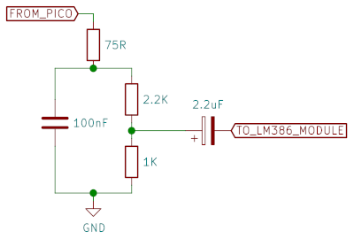
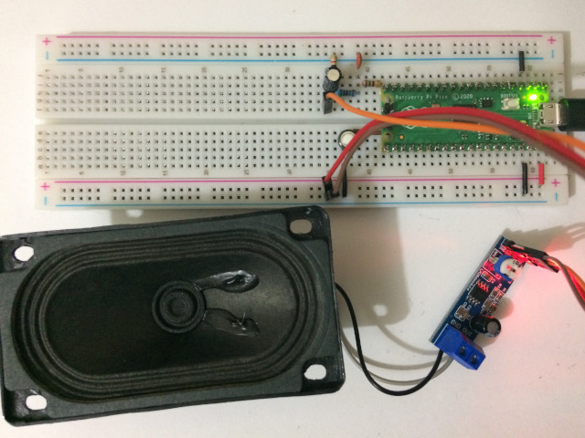
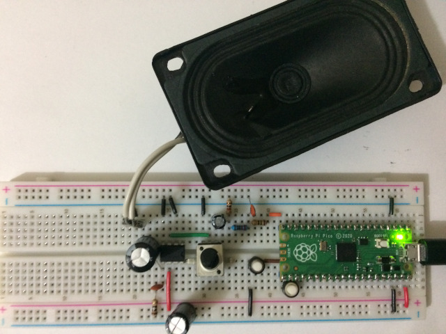
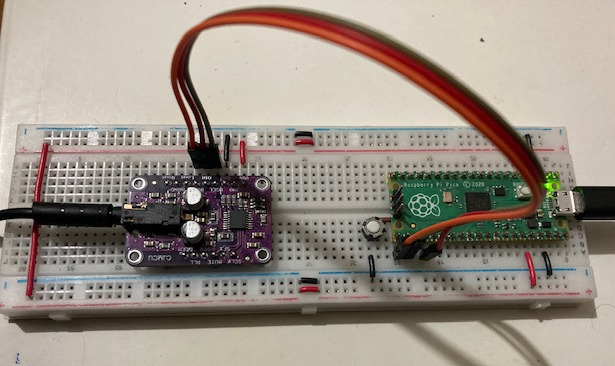

# pico-mod-player

A simple MOD player for the Raspberry Pi Pico.

This project supports generating either I2S or PWM output.  The PWM
audio output code is based on the PWM/DMA code described in [this
blog post](https://gregchadwick.co.uk/blog/playing-with-the-pico-pt3/)
by Greg Chadwick.

The MOD player is currently very basic, outputting mono with 8 bits per
sample without support for many MOD effects (like tremolo and
vibrato).  Still, it does a nice enough job of playing most MODs I've
tested so far.

To convert a MOD file for playing in the Pico you'll need the `mod2h`
tool from [this project](https://github.com/moefh/mod-tools) to
convert the MOD file to a C header file for inclusion in the code.

## PWM Output Using an External Amplifier Module

In this mode, the sound is output to the selected pin as PWM, so you'll need
a capacitor to smooth the waveform, some resistors to lower the voltage
level and a coupling capacitor to remove the DC offset.  Here's what I
used to send the sound over to a [cheap LM386
module](https://pt.aliexpress.com/item/32664418371.html):



And this is the setup on a breadboard connected to the LM386 module:



This setup will likely work well with other amplifier modules. If you
have a stereo module, just connect the single output to both left and
right inputs of the amplifier module.

The output of the module is connected to a small 8Ω speaker.

## PWM Output Using an LM386 Chip as the Amplifier

An alternative is to use just the LM386 chip, here's the schematic I
used (it merges the previous schematic and with a sample taken from
the LM386 datasheet):


And this is the setup on a breadboard with the LM386 chip:



As before, the output of the amplifier is connected to a small 8Ω speaker.

## I2S Output

This mode generates a standard I2S output with 2 channels and 8 bits per sample
(both channels have the same value, so the output is effectively mono).

This is the setup on a beadboard using an [UDA1334A I2S DAC module](https://pt.aliexpress.com/item/1005004350631653.html):




## Source Code

To build the code, make sure you have the **pico-sdk** installed
correctly, and then:

```
git clone https://github.com/moefh/pico-mod-player.git
cd pico-mod-player
mkdir build
cd build
cmake ..
make
```

This will build 3 binaries you can send to the Pico:
`simple/simple_mod_player.uf2`, `async/async_mod_player.uf2`, and
`i2s/i2s_mod_player.uf2`.

### Simple PWM Player

The "simple" MOD player in the directory `simple/` plays the MOD in
the main CPU core (the core where your code starts running in
`main()`).  It must periodically call the MOD player to fill the
output sound buffer from your main loop; something like (see
`simple/main.c`):

```C
// [...]

#include "audio.h"
#include "mod_play.h"

static void update_mod_player(void)
{
  uint8_t *audio_buffer = audio_get_buffer();
  if (audio_buffer) {
    mod_play_step(audio_buffer, AUDIO_BUFFER_SIZE);
  }
}

// [...]

int main(void)
{
  // [...]

  audio_init(/* ... stuff ... */);
  mod_play_start(/* ... stuff ... */);

  while (1) {
    // [...]
    update_mod_player();
  }
}
```


### Asynchronous PWM Player

The "async" MOD player in the directory `async/` plays the MOD from
the second CPU core (`core1`).  It tells the MOD to start playing
and forgets about it (see `async/main.c`):

```C
// [...]

#include "async_msg.h"
#include "mod_data.h"

// [...]

int main(void)
{
  // [...]

  async_init();
  async_audio_init(/* ... same stuff as before */);
  async_mod_start(/* ... same stuff as before */);

  while (1) {
    // no need to update the MOD player here
  }
}
```

### I2S Player

The I2S player in the directory `i2s/` works almost exactly like the simple player,
except you have to copy the samples generated by the MOD player to the I2S output,
since it expects both left and right channels and signed 8-bit samples.

```C
// [...]

#include "sound_i2s.h"
#include "mod_play.h"

// [...]

static void update_mod_player(void)
{
  static int8_t *last_buffer;
  static unsigned char tmp_buffer[SOUND_I2S_BUFFER_NUM_SAMPLES];

  int8_t *buffer = sound_i2s_get_next_buffer();
  if (buffer != last_buffer) {
    last_buffer = buffer;

    // send MOD player output to tmp_buffer:
    mod_play_step(tmp_buffer, SOUND_I2S_BUFFER_NUM_SAMPLES);

    // copy tmp_buffer to I2S output buffer:
    for (int i = 0; i < SOUND_I2S_BUFFER_NUM_SAMPLES; i++) {
      int8_t sample = tmp_buffer[i] - 128;  // make it a signed 8-bit sample
      *buffer++ = sample;
      *buffer++ = sample;
    }
  }
}

int main(void)
{
  stdio_init_all();
  led_init(LED_PIN);

  sound_i2s_init(/* ... stuff ... */);
  mod_play_start(/* ... stuff ... */);
  sound_i2s_playback_start();

  while (1) {
    // [...]
    update_mod_player();
  }
}

```


## License

The source code is distributed under the MIT License.

This project includes the MOD song "[The
Soft-liner](https://modarchive.org/index.php?request=view_by_moduleid&query=61156)"
by Zilly Mike, licensed under Creative Commons [CC BY
3.0](https://creativecommons.org/licenses/by/3.0/). No changes were
made other than the conversion from the MOD to a header file for
inclusion in the code.
